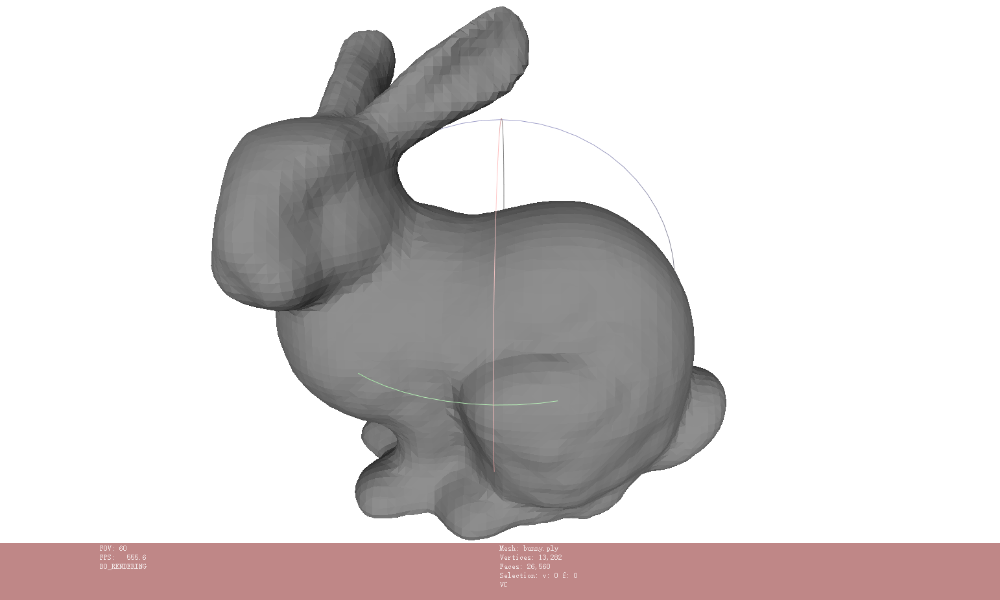
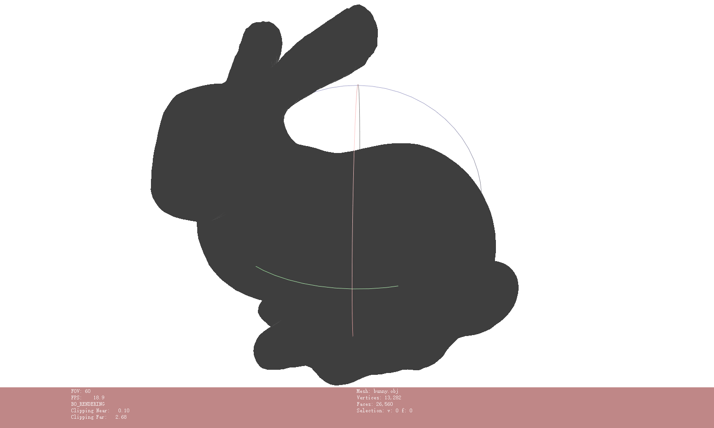

# CuMCubes
`CuMCubes` is an **CUDA** implementation of the marching cubes algorithm to extract iso-surfaces from volumetric data. The volumetric data can be given as a three-dimensional `torch.Tensor` or as a Python function `f(x, y, z)`.

## Requirements
The enviroment of my developer machine:
- Python 3.8.8+
- PyTorch 1.10.2
- CUDA 11.1


## Installation
You can use `pip install cumcubes` directly, or use:
```sh
python setup.py install
```
Or use:
```sh
pip install .
```
Or use:
```sh
pip install https://github.com/lzhnb/CuMCubes
```


## Example
```sh
# toy examples from the PyMCubes
python examples/sphere.py
python examples/function.py
# we extract the sdf of bunny via `mesh_to_sdf`
python examples/bunny_sdf.py
```

The following example creates a `torch.Tensor` volume with spherical iso-surfaces and extracts one of them (i.e., a sphere) with mcubes.marching_cubes. The result is exported to sphere.dae:
```python
>>> import torch
>>> import cumcubes

>>> X, Y, Z = torch.meshgrid(torch.linspace(0, 99, 200), torch.linspace(0, 99, 200), torch.linspace(0, 99, 200), indexing="ij")
>>> DENSITY_GRID = ((X - 50)**2 + (Y - 50)**2 + (Z - 50)**2 - 25**2).cuda()
>>> with cumcubes.Timer("cuda marching cube: {:.6f}s"):
>>>     vertices_cu, faces_cu = cumcubes.marching_cubes(DENSITY_GRID, 0, verbose=True) # verbose to print the number of vertices and faces
# cuda marching cube: 0.004981s

""" Compare with the CPU implementation """
>>> density_grid_cpu = DENSITY_GRID.cpu().numpy()
>>> with cumcubes.Timer("cpu marching cube: {:.6f}s"):
>>>     vertices_c, faces_c = mcubes.marching_cubes(density_grid_cpu, 0)
# cpu marching cube: 0.337798s
```

 
The left image is the result of `cumcubes.marching_cubes`, the right image is the result of `mcubes.marching_cubes`. (The Stanford Bunny Example)

> NOTE: Mallocating memory on GPU will consume some time.

## TODO
- [x] Python wrapper
- [x] Examples (More Example)
- [x] Realizing `marching_cubes_func`
- [x] Support CPU version(wrapper of `mcubes`)
- [x] Release as python package
- [ ] Support C++ template
- [ ] Optimize the code
- [ ] Sparse Marching Cubes
- [ ] Support more mesh file formats.
- [ ] CUDA-implementation SDF
- [ ] Smoothing components


## Acknowledgement
- [PyMCubes](https://github.com/pmneila/PyMCubes)
- [instant-npg](https://github.com/NVlabs/instant-ngp)
- [AnalyticMesh](https://github.com/Gorilla-Lab-SCUT/AnalyticMesh)

> Please feel free to discuss :)
